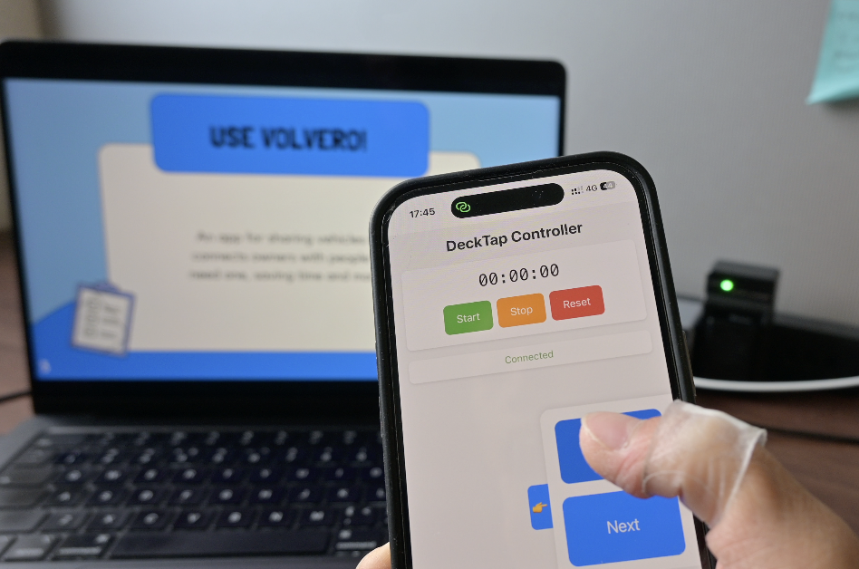
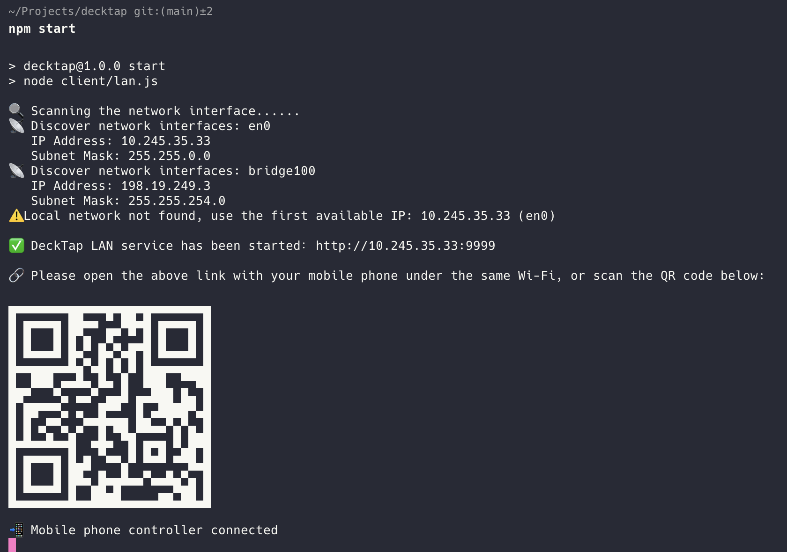
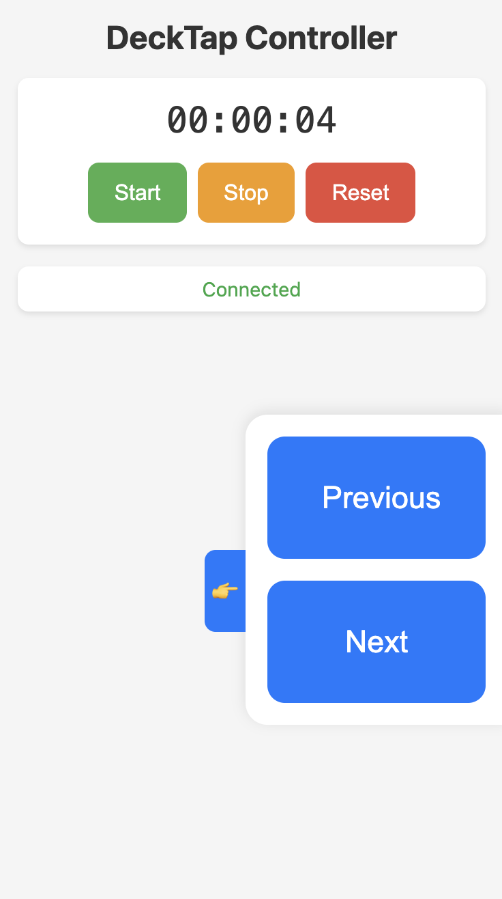

# DeckTap (LAN MVP)

<a href="https://youtu.be/pNgNUWSf7C4" title="Link Title"></a>

📡 DeckTap is a lightweight local-network remote for controlling presentations.  
Use your phone to wirelessly control PowerPoint, Keynote, PDF slideshows — no app installation needed.

---

## ✨ Features

- 📱 Control slides via your phone browser
- 🌐 Works over local Wi-Fi/Hotspot network
- 🖥 Simulates keyboard arrow keys to navigate slides
- 🚀 Minimal setup: run a local Node.js server and scan a QR code
- 🔒 No internet required, **safe** and **private**

---

## 📦 Project Structure
```yaml
decktap/
├── client/            # Computer side agent
│    ├── lan.js        # LAN control
│    ├── cloud.js      # Connect cloud relay server in the future
│    └── config.js
│
├── controller/        # Mobile phone controller web page
│    └── index.html
│
├── server-cloud/      # Cloud server for remote control in the future
│    └── server.js
│
├── README.md
├── LICENSE
├── package.json
└── .gitignore
```
---

## 🔧 Prerequisites

### macOS Permissions
DeckTap uses `@nut-tree/nut-js` to simulate keyboard events. On macOS, you need to grant Accessibility permissions to your terminal:

1. Open **System Settings** > **Privacy & Security** > **Accessibility**
2. Click the lock icon 🔒 to make changes
3. Click the **+** button
4. Select `Terminal.app` (or iTerm, VS Code, etc. depending on what you use)
5. Check the box next to your terminal app

> **Note**: Without these permissions, DeckTap won't be able to control your presentations.

---

## 🚀 Getting Started (LAN Mode)
1. Install dependencies:
   ```bash
   npm install
   ```

2. Grant accessibility permissions (macOS only):
   - Follow the steps in [macOS Permissions](#macos-permissions)
   - Restart your terminal after granting permissions

3. Start the server:
   ```bash
   npm start
   ```

4. Connect with your phone:
   - Connect your phone to the same WiFi network as your computer
   - Open the displayed URL in your phone's browser or Scan the QR code
   - 
   - Start controlling your presentation (Use 👉 to switch left and right hand mode)
   - 
  

---

## 🖱️ Standalone Distribution Quick Start

If you received a **standalone executable version** of DeckTap (such as `decktap-macos`, `decktap-win.exe`, or `decktap-linux`), you can run it directly without installing Node.js or any dependencies.

### Steps
1. **macOS / Linux users:**
   - Before the first run, grant execute permission (only needed once):
     ```bash
     chmod +x decktap-macos
     ```
   - Run:
     ```bash
     ./decktap-macos
     ```
2. **Windows users:**
   - Run it in the command prompt:
     ```bat
     decktap-win.exe
     ```
3. **First run on macOS:** Please follow the terminal prompts to grant Accessibility permissions (see above [macOS Permissions](#macos-permissions)).

4. **Scan the QR code or open the displayed URL on your phone to start controlling your presentation!**

---

> If you encounter issues such as failure to run, insufficient permissions, or cannot access the page, please send the terminal error message to the developer for help.